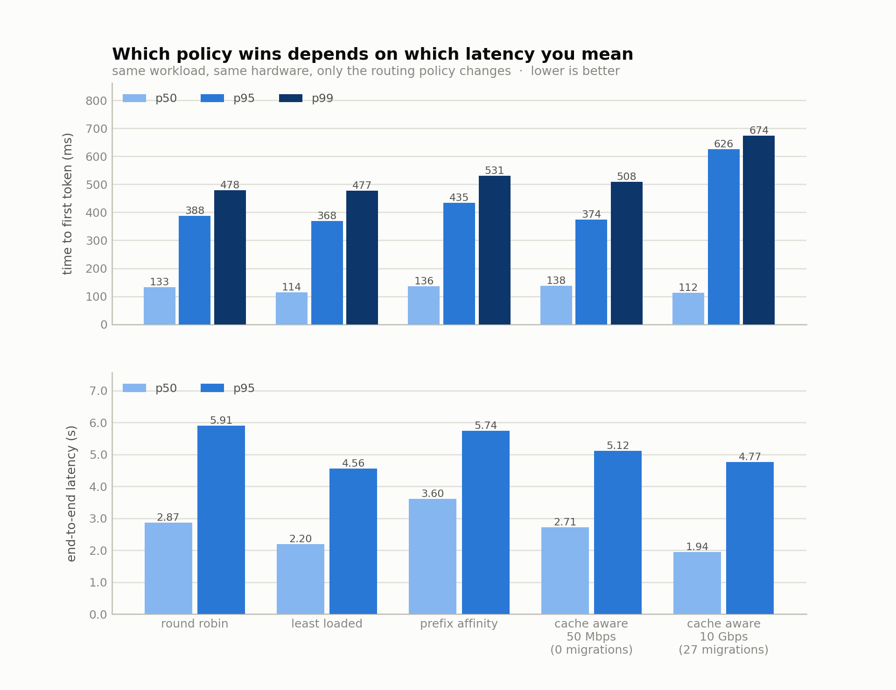
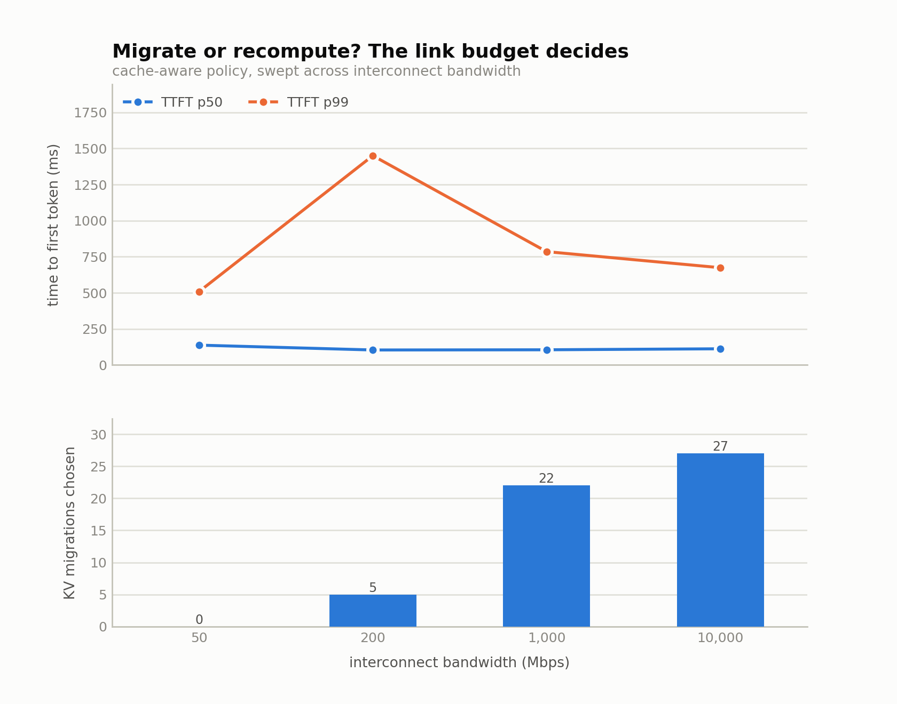
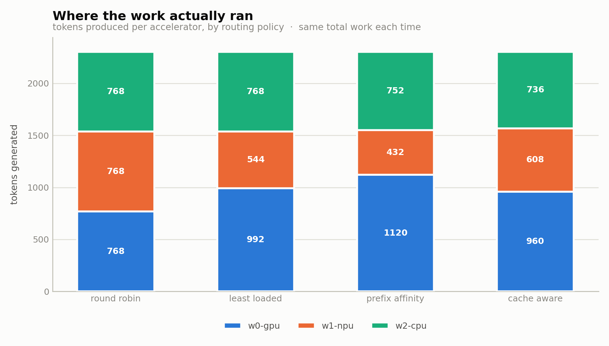

# hetero-serve

A KV-cache-aware LLM serving scheduler that decides, per request, whether it is cheaper
to **ship a KV cache across the network** or to **recompute it from scratch** — with a
paged KV cache, continuous batching, and a **fused CUDA paged-attention kernel**.

<p align="center">
  
</p>

[](https://github.com/mneha05/hetero-serve/actions/workflows/ci.yml)
[](https://colab.research.google.com/github/mneha05/hetero-serve/blob/main/notebooks/verify_cuda_kernel.ipynb)

**The headline, measured on a Tesla T4:** profiling my own decode step showed a third
of it was the host gathering KV blocks into contiguous tensors — pure overhead created
by paging. So I wrote the kernel that removes it. The fused online-softmax kernel runs
**7.8x faster than the gather path and reaches 30% of the card's peak memory
bandwidth, up from 3.8%.** Nsight then showed the remaining gap is occupancy, not
bandwidth — [details below](#what-nsight-says-to-do-next). Click the badge to
reproduce all of it on a free GPU.

---

### Start here

| | |
|---|---|
| ▶ **Run the kernels on a free GPU** | [open in Colab](https://colab.research.google.com/github/mneha05/hetero-serve/blob/main/notebooks/verify_cuda_kernel.ipynb) · [notebook source](notebooks/verify_cuda_kernel.ipynb) |
| 🚀 **See it work in 60 seconds** | [`run_demo.py`](run_demo.py) |
| 📊 **The measurements** | [T4 kernel results](#measured-on-a-tesla-t4) · [Nsight profile](#what-nsight-says-to-do-next) · [policy sweep](#results) · [raw data](results/) |
| 🐛 **What I got wrong** | [four bugs, found by measuring](#what-went-wrong-the-useful-part) |
| 🐳 **Reproduce it anywhere** | [`Dockerfile`](Dockerfile) (CPU) · [`Dockerfile.cuda`](Dockerfile.cuda) (kernels) · [CI](.github/workflows/ci.yml) |
| 🕹 **Drive the scheduler in a browser** | [`web/`](web/) — send prompts, watch blocks fill and caches migrate |

**The code, in the order it is worth reading:**

| file | what it is |
|---|---|
| [`model/paged_attn_v3.py`](heteroserve/model/paged_attn_v3.py) | the **fastest kernel** — context-split, written because the profiler said so |
| [`model/paged_attn_v2.py`](heteroserve/model/paged_attn_v2.py) | the online-softmax kernel it builds on |
| [`model/paged_attn.py`](heteroserve/model/paged_attn.py) | the naive v1 kernel it is measured against, plus the torch reference |
| [`config.py`](heteroserve/config.py) | model geometry incl. GQA — `n_kv_head` is what moves the crossover |
| [`kv/blocks.py`](heteroserve/kv/blocks.py) | paged KV cache: chain hashing, refcounts, eviction, migration |
| [`sched/router.py`](heteroserve/sched/router.py) | the migrate-vs-recompute cost model |
| [`worker/worker.py`](heteroserve/worker/worker.py) | one device, one KV pool, continuous batching |
| [`net/shaper.py`](heteroserve/net/shaper.py) | the token bucket that makes the link budget real |

<details>
<summary><b>Full contents</b></summary>

- [The question I actually wanted to answer](#the-question-i-actually-wanted-to-answer)
- [The hardware I had (and didn't have)](#the-hardware-i-had-and-didnt-have)
- [What it's made of](#what-its-made-of)
- [Running on NVIDIA, and a fused paged-attention kernel](#running-on-nvidia-and-a-fused-paged-attention-kernel)
  - [Two kernels, because the first one was naive](#two-kernels-because-the-first-one-was-naive)
  - [Measured on a Tesla T4](#measured-on-a-tesla-t4)
  - [What Nsight says to do next](#what-nsight-says-to-do-next)
  - [What is verified, and what is not](#what-is-verified-and-what-is-not)
- [Results](#results)
  - [The same sweep on a T4](#the-same-sweep-on-a-t4)
  - [Where the migration crossover actually is](#where-the-migration-crossover-actually-is)
  - [Where a decode step really goes](#where-a-decode-step-really-goes)
- [What went wrong (the useful part)](#what-went-wrong-the-useful-part)
- [The NPU tax](#the-npu-tax)
- [Run it](#run-it)
- [Tests](#tests)
- [Honest limitations](#honest-limitations)
- [Layout](#layout)

</details>

Runs on NVIDIA (CUDA), on Intel Arc GPU / NPU / CPU (OpenVINO), or on nothing but numpy.
Real GPT-2 weights, real worker processes, real TCP sockets, a real token-bucket
bandwidth shaper. Every number below was measured, and where something is *not*
verified I say so.

---

## The question I actually wanted to answer

I spent a long time working on modems, where the whole job is knowing when moving
bytes is cheaper than not moving them. Serving LLMs turns out to have the same shape
of problem hiding inside it.

When a request arrives that shares a long prefix with an earlier one — a system
prompt, a RAG document, an earlier turn of a conversation — its KV cache may already
exist, but on the *wrong* accelerator. You have three options:

1. run it on the accelerator that has the cache, even if that device is busy
2. run it elsewhere and recompute the prefix from scratch
3. run it elsewhere and drag the KV cache over the interconnect

Option 3 is a bandwidth-vs-compute trade, and I wanted to find where it flips.
For GPT-2 124M at fp16, one token of KV cache is **36 KiB across all layers**
(`2 × 12 layers × 768 dims × 2 bytes`), so a 512-token prefix is **18.9 MB**. At
10 Gbps that's 15 ms and obviously worth moving. At 50 Mbps it's 3.0 seconds and
obviously not. The interesting part is the middle, and what the wrong answer costs
you at p99.

---

## The hardware I had (and didn't have)

I do not own a multi-GPU box. I have a Dell 14 Plus with a Lunar Lake chip. But that
chip has **three independently targetable compute devices**, which turns out to be a
more interesting problem than a homogeneous GPU cluster, because they are not
interchangeable:

| device | hardware | what it's good at |
|---|---|---|
| `GPU` | Intel Arc 140V (8 GB, integrated) | fastest prefill; fastest decode at long context |
| `NPU` | Intel AI Boost | fastest decode at *short* context, then loses to shape padding |
| `CPU` | Core Ultra 7 256V, 8 threads | steady, no compile cost, no padding tax |

Each worker is a real OS process bound to one device. `scripts/probe_devices.py`
compiles real graphs to find out what each one supports, rather than trusting docs:

```
device   name                                        dynamic shapes  >4D tensors
CPU      Intel(R) Core(TM) Ultra 7 256V                         yes          yes
GPU      Intel(R) Arc(TM) 140V GPU (8GB) (iGPU)                 yes          yes
NPU      Intel(R) AI Boost                                       NO           NO
```

Those two `NO`s shaped the whole engine design (see [The NPU tax](#the-npu-tax)).

The same script then times GPT-2 124M on each of them — 128-token prefill, batch-4
decode, checked against the numpy reference:

| engine | prefill 128 tok | decode batch-4 | vs numpy | argmax matches numpy |
|---|---:|---:|---:|:--:|
| numpy (reference) | 707 ms | 428 ms | 1.0× | — |
| OpenVINO CPU | 69.8 ms | 31.6 ms | 10.1× | yes |
| **Arc 140V GPU** | **21.6 ms** | 30.1 ms | 32.8× | yes |
| **NPU** | 20.8 ms | **21.0 ms** | 34.1× | yes |

All three agree with the reference implementation on the predicted token. The
OpenVINO paths run fp16 internally, so logits differ in the third decimal — which is
why the correctness tests assert on argmax and on paged-vs-contiguous equivalence
rather than on bit equality.

---

## What it's made of

```
                    ┌──────────────────────────────────────┐
   requests ───────▶│  ROUTER  (control plane)             │
                    │                                      │
                    │  • global prefix directory           │
                    │      block-chain hash → {workers}    │
                    │  • cost model, priced in seconds     │
                    │      stay    = queue + recompute     │
                    │      migrate = queue + transfer      │
                    │                + recompute remainder │
                    │  • device speeds measured, not       │
                    │    guessed                           │
                    └───┬──────────────┬──────────────┬────┘
                        │              │              │      control plane (fast)
              ┌─────────▼───┐  ┌───────▼─────┐  ┌─────▼─────┐
              │  worker 0   │  │  worker 1   │  │ worker 2  │
              │  Arc GPU    │  │  NPU        │  │ CPU       │
              │             │  │             │  │           │
              │ paged KV    │  │ paged KV    │  │ paged KV  │
              │ continuous  │  │ continuous  │  │ continuous│
              │  batching   │  │  batching   │  │  batching │
              └──────┬──────┘  └──────┬──────┘  └─────┬─────┘
                     └────────────────┴───────────────┘
                        data plane: KV blocks over TCP,
                        through a token-bucket shaper
                        (bandwidth + latency + jitter)
```

**Paged KV cache** (`heteroserve/kv/blocks.py`). Fixed 16-token blocks, refcounted,
with vLLM-style automatic prefix sharing. Blocks are hashed by *chain* — block *i*'s
hash covers every token from position 0 through the end of block *i* — so a hash match
is a genuine shared-prefix match and not a coincidence. Unreferenced blocks stay
cached and are evicted LRU only under pressure. Because a prefix is a *set of blocks*
rather than a contiguous slab, it can be sliced, shared, and shipped.

**The engines** (`heteroserve/model/`). A numpy GPT-2 that serves as the correctness
oracle, and an OpenVINO graph built op-by-op that runs on any of the three devices.
The graph is hand-built rather than imported from ONNX because the KV cache has to be
an **input and an output** of the model: the scheduler owns the cache, so the engine
must accept whatever the block allocator gathered and hand the new K/V back every step.

**The network** (`heteroserve/net/`). Workers talk over real TCP. Outgoing KV transfers
pass through a token bucket sized to the configured bandwidth, then a propagation
delay. Concurrent transfers **contend for the same bucket**, which matters more than
I expected (below). When the benchmark says 2.3 s went into moving KV, the process
really did sit there for 2.3 s.

**The scheduler.** The router picks *where*; each worker decides *when*, with
prefill-priority chunked continuous batching and recompute-preemption when it runs out
of blocks.

---

## Running on NVIDIA, and a fused paged-attention kernel

The Intel path above is what I had on my desk. The CUDA path is the one that matters
for the interesting version of the problem, and it exists because of a number this
project measured about itself:

> A third of a GPU decode step was **not accelerator time**. It was the host gathering
> each sequence's KV blocks into contiguous tensors so the engine could read them —
> overhead created entirely by paging the cache.

So I wrote the kernel that deletes it. `heteroserve/model/paged_attn.py` holds a CUDA
kernel that walks each sequence's **block table inside the attention loop**, reading K
and V straight out of the paged pool. One CUDA block per (sequence, head); the block
indirection happens per position, so the contiguous copy never exists. Same idea as
vLLM's paged attention.

Three pieces make it work:

| file | what it does |
|---|---|
| `kv/torch_blocks.py` | KV pool as a CUDA tensor. All the allocator logic — refcounts, chain hashing, eviction, prefix matching — is inherited unchanged; only the five storage methods are overridden. `pool[layer, 0]` is exactly the `[num_blocks, block_size, H, D]` view the kernel indexes. |
| `model/torch_engine.py` | GPT-2 on CUDA, with **both** decode paths: `decode_batch` (gather, the control) and `decode_batch_paged` (fused, the treatment). |
| `model/paged_attn.py` | **v1 kernel** (naive fused), a pure-torch paged reference, and `which_backend()` so nothing can silently report a torch number as a kernel result. |
| `model/paged_attn_v2.py` | **v2 kernel** — online softmax, warp-per-head, coalesced loads, shuffle reductions — plus the bandwidth-roofline helpers. |

Nothing else changed. The router, cost model, shaper, transport, migration and paged
allocator are all device-agnostic, so `--devices cuda:0,cuda:1` just works.

### Two kernels, because the first one was naive

`paged_attn.py` (**v1**) is the straightforward fused kernel: it stores every attention
score in shared memory, walks the context with scalar loads, and reduces through a
shared-memory tree. Correct, and a fair first draft — but it caps context length by how
much shared memory a block can hold, reads memory in close to the worst pattern, and
leaves half the block idle in the phase that dominates.

`paged_attn_v2.py` (**v2**) takes the hardware seriously:

1. **Online softmax** — the algorithmic change. Instead of materialising the score
   vector, v2 keeps a running max `m` and running sum `l` and rescales the accumulator
   as it streams, exactly like FlashAttention:

   ```
   m_new = max(m, s)
   l     = l * exp(m - m_new) + exp(s - m_new)
   acc   = acc * exp(m - m_new) + exp(s - m_new) * v
   ```

   Shared memory becomes **O(1) in context length**, K and V are each read exactly
   once, and the kernel stops caring how long the sequence is.
2. **One warp per (sequence, head)** — 32 lanes cooperate on one 64-wide dot product,
   so no lane idles.
3. **Coalesced per-lane slices** — each lane owns a contiguous `head_dim/32` slice and
   consecutive lanes own consecutive slices, so one warp reading one position issues a
   single 128-byte transaction. v1 read one scalar at a time strided by `head_dim`.
4. **Warp-shuffle reductions** — `__shfl_down_sync` instead of a shared-memory tree: no
   `__syncthreads`, no shared traffic, no bank conflicts.

Decode attention is **memory-bandwidth bound** — every cached K and V is read once and
almost no arithmetic happens per byte. So the number worth reporting is not a speedup
over an arbitrary baseline, it is **achieved GB/s against the card's peak**, and
`scripts/bench_kernel.py` prints exactly that.

### Measured on a Tesla T4

Both kernels compile and pass, and here is what they actually achieve. Decode
attention must read every cached K and V exactly once, so the honest score is
achieved bandwidth against the card's 320 GB/s peak:

The benchmark also runs **PyTorch's `scaled_dot_product_attention`** (cuDNN /
FlashAttention underneath) over the same gathered data. Beating my own einsum proves
nothing; SDPA is what you would actually reach for without a paged kernel, so it is the
baseline that counts.

**batch 16, context 512** (25.2 MB of KV per call)

| path | per call | vs gather | GB/s | % of peak | max err |
|---|---:|---:|---:|---:|---:|
| gather + dense attention | 4105 us | 1.0x | 6.1 | 1.9% | — |
| gather + PyTorch SDPA | 3825 us | 1.1x | 6.6 | 2.1% | 4.2e-07 |
| v1 kernel (naive fused) | 545 us | 7.5x | 46.2 | 14.4% | 4.8e-07 |
| v2 kernel (online softmax) | 651 us | 6.3x | 38.7 | 12.1% | 6.6e-07 |
| **v3 kernel (16-way split)** | **170 us** | **24.2x** | **148.1** | **46.3%** | 2.1e-07 |

**batch 32, context 2048** (201.3 MB of KV per call)

| path | per call | vs gather | GB/s | % of peak | max err |
|---|---:|---:|---:|---:|---:|
| gather + dense attention | 18207 us | 1.0x | 11.1 | 3.5% | — |
| gather + PyTorch SDPA | 12115 us | 1.5x | 16.6 | 5.2% | 7.7e-07 |
| v1 kernel (naive fused) | 3030 us | 6.0x | 66.4 | 20.8% | 7.5e-07 |
| v2 kernel (online softmax) | 2028 us | 9.0x | 99.3 | 31.0% | 1.0e-06 |
| **v3 kernel (64-way split)** | **1136 us** | **16.0x** | **177.3** | **55.4%** | 2.7e-07 |

Both v3 rows used the **auto-selected** split count — no hand-tuning.

> **On measurement noise:** these are single runs on a shared, thermally throttled
> Colab T4. Repeating the same shape swung v1 between 31.6 and 46.2 GB/s (44%) across
> sessions. The *ordering* is stable and the v3 gap is far larger than the noise, but
> treat any individual figure as +/- 30% rather than exact. Notebook attached — run it
> yourself.

Four things worth reading off these:

- **The gather path is catastrophic** — 2-5% of peak, and *PyTorch's own SDPA barely
  helps* (1.1-1.5x). That is the point: SDPA is an excellent kernel, but it cannot read
  a block table, so it still pays the gather. Once you have paged your KV cache, a
  fast dense kernel is not enough.
- **v2 beats v1 only at long context** (12.1% vs 14.4% at 512; 31.0% vs 20.8% at 2048).
  The online-softmax win is real but it is a *scaling* win, not a constant one — at
  short context v1's simpler inner loop is competitive.
- **v3 is a different regime**: 46-55% of peak, 10-22x PyTorch SDPA on the same paged
  data. Splitting the context was worth more than every micro-optimisation in v2
  combined.
- **45% is still on the table.** A production kernel would go further with async
  copies and better scheduling; this is where I stopped, not where the ceiling is.

End to end, the kernel moved the serving system too: decode went from **110 ms to
57 ms per step**, and end-to-end p50 from **0.67 s to 0.22 s**.

### What Nsight says to do next

Profiling v2 with `ncu --set full` is unambiguous about the bottleneck, and it is not
the one I expected:

```
Memory Throughput          13.67 %
Compute (SM) Throughput    11.34 %
grid (48,1,1) x (32,4,1)

OPT  This kernel grid is too small to fill the available resources on this
     device, resulting in only 0.1 full waves across all SMs.
```

Neither memory nor compute is saturated. The kernel is **occupancy-starved**: 16
sequences x 12 heads = 192 warps = 48 blocks, spread over a T4's 40 SMs, is *0.1 full
waves*. There simply is not enough work in flight to keep the card busy, which caps
everything else.

That named v3, and [`paged_attn_v3.py`](heteroserve/model/paged_attn_v3.py) implements
it: **split the context across blocks** (FlashDecoding, and what vLLM's own
paged-attention v2 kernel does). Each warp takes a slice and emits an un-normalised
partial `(m, l, acc)`; a second pass merges them with the same online-softmax rescale:

```
m_g = max_s m_s
l_g = sum_s l_s * exp(m_s - m_g)
out = sum_s acc_s * exp(m_s - m_g) / l_g
```

A running softmax is associative, which is exactly why it can be split at all.
`num_splits` comes from the device's SM count, so small batches split hard and large
ones barely split. With 8 splits the grid goes from 48 blocks to 384.

The merge is verified without a GPU: `split_merge_reference` implements both passes in
numpy and is tested against dense attention across seven split configurations —
including more splits than tokens (empty slices), a single token, and scores amplified
25x where a naive `exp()` overflows.

It is worth being precise about why this is the interesting finding: the obvious
optimisations — vectorised loads, better reductions, avoiding shared memory — are all
already in v2, and they bought a real 1.35-1.47x. The profiler says none of that is
what is holding it back now. Guessing would have sent me to tune the inner loop; the
measurement said restructure the grid.

### v3, measured

Same T4, batch 16, context 512, sweeping the split count by hand:

| splits | GB/s | % of peak |
|---:|---:|---:|
| 1 | 42.9 | 13.4% |
| 2 | 75.1 | 23.5% |
| 4 | 132.4 | 41.4% |
| 8 | 121.9 | 38.1% |
| 16 | 141.4 | 44.2% |
| **32** | **156.1** | **48.8%** |

**13.4% → 48.8% of peak**, from splitting alone. Against the strong baseline, v3 is
**60x PyTorch SDPA** on the same paged data (156.1 vs 2.6 GB/s) — SDPA is a fast kernel,
but it cannot read a block table, so it pays the gather that v3 deletes.

And the sweep found a bug in my own heuristic. `choose_num_splits` originally targeted
*occupancy* — enough warps to give each SM a few — and picked **2 splits where 32 was
2.1x faster**; at batch 32 / context 2048 it picked 1, i.e. no split at all. Occupancy
was the wrong model. The online softmax is **sequential**, so a warp streaming 512
tokens carries a 512-long dependent chain of exp-and-rescale; splitting shortens the
chain. The heuristic now targets ~32 tokens per split, and only falls back to a
device-fill argument when the context is too short for that.

That is the second time on this project that the number I would have guessed and the
number the hardware reported disagreed, and both times the measurement was the
interesting one.

### Grouped-query attention, and what it does to the crossover

GPT-2 is MHA — every query head carries its own KV head. **Nothing current does that.**
Llama-3-8B has 32 query heads and 8 KV heads; Mistral and Qwen are the same shape. All
three kernels support GQA: a query head reads the KV head it shares with its group,

```cuda
const int kv_h = h / (num_heads / num_kv_heads);
```

so the shared head is *indexed*, never materialised. The KV pool is sized by
`n_kv_head`, which is where the saving actually lives.

The interesting part is not the kernel change, it is what GQA does to the scheduler.
Cutting KV by the group factor cuts the bytes a migration must move by the same factor,
so the bandwidth at which moving beats recomputing drops in lockstep — 512-token prefix,
T4 prefill at 0.59 ms/token:

| attention | KV heads | KV/token | 512-token prefix | crossover |
|---|---:|---:|---:|---:|
| MHA (GPT-2 as-is) | 12 | 36 KiB | 18.9 MB | 503 Mbps |
| GQA 2:1 | 6 | 18 KiB | 9.4 MB | 252 Mbps |
| **GQA 4:1** (Llama-3's ratio) | 3 | 9 KiB | 4.7 MB | **126 Mbps** |
| MQA (1 KV head) | 1 | 3 KiB | 1.6 MB | 42 Mbps |

At Llama-3's 4:1 ratio, migration stops needing a datacenter fabric and starts working
on **commodity networking**. The architectural choice everyone made for memory reasons
turns out to change the distributed-serving calculus too, and this project can measure
that because both halves — kernel and scheduler — are real.

Correctness is pinned by construction: duplicating each shared KV head across its query
group turns a GQA model into an algebraically identical MHA one, and
`test_gqa_equals_mha_with_duplicated_kv_heads` asserts the two produce the same logits.
If the GQA plumbing were wrong anywhere, that test fails.

### Why there are no tensor cores in here

Reasonable question, and the answer is that they would not help. **Decode attention is a
GEMV, not a GEMM** — one query token against N cached keys. It moves 201 MB and does
almost no arithmetic per byte, so it is bound by memory, and tensor cores accelerate
math. My own profile says so directly:

```
Memory Throughput        13.67 %
Compute (SM) Throughput  11.34 %
```

Compute was never the constraint. Tensor cores belong in **prefill**, which is a genuine
GEMM over many query tokens at once — that is a real extension, and it is not what any
of these three kernels do. Reaching for WMMA in a memory-bound decode kernel would be
motion without movement.

### What is verified, and what is not

I do not own an NVIDIA GPU, so I will be precise about this rather than imply more
than I ran:

**Verified on CPU torch** (7 tests in `tests/test_torch_engine.py`, plus one
end-to-end distributed run):

- the CUDA engine's prefill, chunked prefill and decode all match the numpy oracle to 1e-4
- the GPU-resident allocator round-trips KV, shares prefixes and migrates identically to the numpy one
- **the paged-attention algorithm matches dense attention over the true context** — exact, `0.00e+00` max diff, with shuffled non-contiguous block tables and three different sequence lengths

That last one is the important one: it proves the block-table walk is correct. The
kernel only has to match that reference.

`test_torch_paged_decode_path_serves_requests` then runs the **whole system** through
the torch engine with the paged decode path forced on — GPU-resident allocator, block
table construction, in-place KV writes, paged attention, real worker processes, real
sockets — and checks prefix reuse still works. On a CUDA box the identical code takes
the fused kernel instead of the torch fallback.

- **the online-softmax recurrence matches dense attention** — the v2 algorithm is
  implemented in numpy as a scalar streaming loop mirroring the kernel line for line,
  and checked at four context lengths including one with scores 25x amplified, where a
  naive `exp()` would overflow and the running-max rescale is the entire point

The four GPU tests skip cleanly on a machine without CUDA, and **all of them pass on a
T4** — the numbers above are that run.

**Verify it yourself in about two minutes, free**, on a Colab T4 — no GPU required:

**[▶ Open the notebook in Colab](https://colab.research.google.com/github/mneha05/hetero-serve/blob/main/notebooks/verify_cuda_kernel.ipynb)** — set
`Runtime → Change runtime type → T4 GPU`, then `Run all`.
([notebook source](notebooks/verify_cuda_kernel.ipynb)) It compiles
both kernels, runs the correctness suite, prints the bandwidth roofline, and runs the
whole serving system on the GPU.

Or locally on any CUDA box:

```bash
pip install ninja                        # torch builds CUDA extensions through it
pytest tests/test_torch_engine.py -v     # the 4 skipped tests run
python scripts/bench_kernel.py --batch 16 --context 512 --dtype float16
```

> **If the kernels report `torch` instead of `cuda`**, read the reason —
> `which_backend()` and `build_error()` always say why. The usual answer is a missing
> `ninja`, which torch shells out to in order to build extensions and which Colab does
> not ship. It is a build-tool problem, not a CUDA one.

`bench_kernel.py` checks correctness **before** it prints any timing and refuses to
report a speedup if the kernel disagrees with the reference. On a machine without CUDA
it says so in as many words rather than quietly benchmarking the fallback:

```
kernel backend: torch
  (fused CUDA kernel not active: no CUDA device)
  reporting the torch paged path instead — this measures the
  algorithm, NOT the kernel. Numbers here are not a kernel result.
```

Expect to spend one session on a rented box shaking out compile errors. That is the
honest state of it.

---

## Results

48 requests over 6 shared 256-token prefixes drawn Zipf (so a few prefixes are hot),
Poisson arrivals at 6/s, 16 generated tokens each. Every configuration runs 3 times
and the records are pooled — 144 requests per row. `±` is the standard deviation of
throughput across the three repeats.

Raw data for every number below is committed: **[`results/sweep-headline.json`](results/sweep-headline.json)**
(per-configuration summaries, device speeds, host details) and
[`results/requests-headline.csv`](results/requests-headline.csv) (all 1,008 individual
requests, so you can recompute the percentiles yourself). The pre-fix run is kept as
[`results/baseline-idle-link-cost-model.json`](results/baseline-idle-link-cost-model.json)
for the before/after in [what went wrong](#what-went-wrong-the-useful-part).

| policy | link | tok/s | ± | TTFT p50 | TTFT p99 | **E2E p50** | E2E p95 | cache hit | migrations | MB moved |
|---|---:|---:|---:|---:|---:|---:|---:|---:|---:|---:|
| round robin | 50 Mbps | 57.0 | 0.9 | 133 ms | 478 ms | 2.87 s | 5.91 s | 62.9% | 0 | 0 |
| least loaded | 50 Mbps | 60.5 | 0.8 | 114 ms | **477 ms** | 2.20 s | 4.56 s | 62.9% | 0 | 0 |
| prefix affinity | 50 Mbps | 56.4 | 2.2 | 136 ms | 531 ms | 3.60 s | 5.74 s | 78.7% | 0 | 0 |
| cache aware | 50 Mbps | 56.8 | 0.8 | 138 ms | 508 ms | 2.71 s | 5.12 s | 64.8% | 0 | 0 |
| cache aware | 200 Mbps | 61.8 | 1.5 | **104 ms** | 1450 ms | 1.96 s | 4.56 s | 70.5% | 5 | 47 |
| cache aware | 1 Gbps | 60.1 | 0.6 | 106 ms | 785 ms | 1.95 s | **4.45 s** | 76.8% | 22 | 208 |
| cache aware | 10 Gbps | 59.8 | 1.5 | 113 ms | 674 ms | **1.94 s** | 4.77 s | **79.4%** | 27 | 255 |

<picture>
  <source media="(prefers-color-scheme: dark)" srcset="results/figures/ttft-by-policy-dark.png">
  
</picture>

**Throughput barely moves.** 56–62 tok/s across every policy, and the spread is only a
couple of standard deviations. At this arrival rate the cluster is saturated, and
routing decides *whose* latency is good, not how much total work gets done. I expected
a bigger throughput story and did not get one; saying so is more useful than picking
the one column where the gap looks impressive.

**The real win is end-to-end p50: 3.60 s → 1.94 s, a 1.85× improvement** over prefix
affinity. Cache-aware routing gets there by having it both ways — it reaches the
*highest* cache hit rate (79.4%, above affinity's 78.7%) while still spreading load,
because migration lets a device receive a prefix instead of having to be the device
that already owned it.

**No policy wins everything.** Plain least-loaded has the best TTFT tail (477 ms).
Cache-aware at 10 Gbps is worse at p99 (674 ms) because every migrated request pays
the transfer on its critical path. If your SLO is first-token latency, the boring
policy is a completely reasonable answer.

### The same sweep on a T4

The results table above is the Intel machine. Running the identical sweep on a T4 with
the fused kernel active (two workers on one card, 32 requests, 2 repeats):

| policy | link | tok/s | TTFT p50 | TTFT p99 | E2E p50 | E2E p95 | hit | migrations |
|---|---:|---:|---:|---:|---:|---:|---:|---:|
| round robin | 50 Mbps | 93.3 | 37 ms | 187 ms | 0.33 s | 0.87 s | 62.9% | 0 |
| least loaded | 50 Mbps | 93.3 | 32 ms | 102 ms | 0.30 s | 0.42 s | 62.9% | 0 |
| prefix affinity | 50 Mbps | 93.2 | 23 ms | 111 ms | **0.215 s** | 0.42 s | 77.1% | 0 |
| cache aware | 200 Mbps | 93.8 | 24 ms | **77 ms** | 0.243 s | 0.44 s | 75.7% | 0 |
| cache aware | 1 Gbps | 93.8 | 25 ms | 176 ms | 0.236 s | **0.37 s** | 77.1% | 4 |
| cache aware | 10 Gbps | 93.4 | 30 ms | 123 ms | 0.266 s | 0.38 s | 77.1% | 10 |

The ranking changes, and that is the interesting part. On a T4 prefill costs
**0.59 ms/token**, so recomputing a 256-token prefix is ~150 ms — cheap enough that
plain prefix affinity nearly ties the cost model, and migration has much less room to
help. **The migrate-vs-recompute crossover moves with device speed, not just link
speed:** the faster your accelerator, the less attractive moving KV becomes, because
the thing you are avoiding got cheaper. That is not a conclusion I could have reached
on one machine.

### Where the migration crossover actually is

<picture>
  <source media="(prefers-color-scheme: dark)" srcset="results/figures/bandwidth-crossover-dark.png">
  
</picture>

At **50 Mbps the scheduler refuses to migrate at all** — 0 out of 144 requests — which
is the correct call: moving a 9.4 MB prefix costs ~1.5 s against ~130 ms to recompute
it. As bandwidth rises it migrates more (5 → 22 → 27) and end-to-end latency improves.

The ugly point in the middle is the honest one. **At 200 Mbps, p99 TTFT spikes to
1.45 s** — worse than never migrating. That is the marginal regime: a handful of
transfers look individually affordable, get approved, and then collide on the link and
on the receiving worker. Being *nearly* fast enough to migrate is worse than being
clearly too slow.

### Migration is still 30× more expensive than the link model predicts

| link | payload | modelled | measured | effective rate |
|---|---:|---:|---:|---:|
| 200 Mbps | 9.44 MB | 380 ms | 1226 ms | 8 MB/s |
| 1 Gbps | 9.44 MB | 78 ms | 462 ms | 20 MB/s |
| 10 Gbps | 9.44 MB | 9.5 ms | 290 ms | 33 MB/s |

Effective throughput plateaus around 20–33 MB/s no matter how fast the link is, so
above a few hundred Mbps **migration is not bandwidth-bound at all**. Two causes, both
measured:

- **Head-of-line blocking** behind the engine's own step lock — see [bug #4](#4-i-held-the-engine-lock-through-a-multi-megabyte-memcpy).
  On an *idle* cluster the same transfer runs at 143 MB/s; the gap is contention, not
  the wire.
- **It sits on the critical path.** The request waits for its KV before it is even
  admitted. Overlapping the transfer with prefill of the uncached remainder is the
  obvious fix and is not implemented.

### Where a decode step really goes

`scripts/profile_decode.py`, batch 8, 288-token context, 84.9 MB of KV touched per step:

| device | gather | engine | write | total | gather share |
|---|---:|---:|---:|---:|---:|
| Arc GPU | 44.0 ms | 89.3 ms | 0.4 ms | 133.7 ms | 33% |
| NPU | 47.4 ms | 192.1 ms | 0.5 ms | 240.0 ms | 20% |
| CPU | 50.5 ms | 120.6 ms | 0.5 ms | 171.5 ms | 29% |
| numpy | 44.2 ms | 440.3 ms | 0.4 ms | 484.9 ms | 9% |

A third of a GPU decode step is **host-side numpy paging**, not accelerator time: my
attention gathers each sequence's blocks into contiguous tensors before calling the
engine, because OpenVINO cannot index the block pool directly. A fused paged-attention
kernel reads the block table in place and never pays this. It is the single biggest
inefficiency in the project, and it is a consequence of building paging *around* a
graph runtime rather than inside a kernel.

Note the NPU inverting here: fastest at 128-token context (27 ms) but slowest at 288
(192 ms), because 288 pads up to a 512 bucket and it computes ~1.8× the attention it
needs.

<picture>
  <source media="(prefers-color-scheme: dark)" srcset="results/figures/device-split-dark.png">
  
</picture>

---

## What went wrong (the useful part)

Four things I got wrong. Every one was caught by measuring, not by reading the code —
which is the actual argument for building the benchmark harness before trusting the
scheduler.

### 1. I priced migrations against an idle link

The first cost model asked "how long does 18 MB take at this bandwidth?" and compared
that to recompute. Individually each migration looked cheap. Collectively they were
not: six of them landed on the same egress token bucket at once and queued. Tail
latency at 200 Mbps went to **3.3 s p99** — worse than the naive policy that never
migrates at all.

The fix is one term. A migration is now priced behind whatever is already in flight:

```python
mig_s = link.transfer_seconds(mig_bytes + self.inflight_migration_bytes)
```

That alone took p99 at 200 Mbps from 3.31 s to 1.82 s, and cut the number of
migrations it green-lit from 6 to 4. Congestion you cause yourself is still
congestion — obvious in hindsight, and exactly the mistake a bandwidth-naive
scheduler makes.

### 2. My "measured" device speeds were measuring the queue

The router prices placement using per-device prefill and decode costs, which it
measures at startup. I derived them from request latency: ms/token from
`first_token − admit`, ms/step from the gap between output tokens.

Both are contaminated. The first folds in queueing delay; the second folds in
prefill contention from other sequences on the same worker. So the "device speed"
moved with load instead of with the hardware, and calibration swung **4–6× between
runs of identical code** — NPU decode measured 55 ms/step one run and 212 ms/step the
next, which was enough to make the router abandon a perfectly good accelerator.

Now each worker times its own engine calls, split by phase, and the router divides
device-busy-time by work done. Queueing is modelled separately, where it belongs.

### 3. A rejected request hung forever

When a worker's KV pool is full it refuses admission, and the router is supposed to
try elsewhere. It updated its bookkeeping to point at the new worker — and never
actually sent the request. The caller waited on a future nothing would ever resolve.

Now it re-dispatches for real and remembers which workers already refused, so a
request cannot bounce between two full devices forever. Two regression tests cover it:
one asserts an impossible request raises promptly instead of hanging, the other that a
request refused by a full worker still completes somewhere else.

### 4. I held the engine lock through a multi-megabyte memcpy

Migrations were running at ~20 MB/s regardless of link speed. My first guess was the
serialisation path — the 6D transpose in `export_blocks` looked like an obvious
suspect. I benchmarked it before changing anything, and I was wrong: the whole
export → `tobytes` → import round trip is **5.8 ms for 9.4 MB**, and the transpose I
suspected is actually the *faster* of the two layouts I tried.

The real cause was a lock. Both `export_blocks` and `import_blocks` ran while holding
the worker's state lock — the same lock the engine holds for the duration of a decode
step. With GPT-2 a step is ~200 ms, and a migration waits out a step on the donor
*and* on the receiver, which is almost exactly the 424 ms observed. A controlled
idle-vs-loaded experiment confirmed it.

The fix is to hold the lock only for metadata (match, incref, reserve) and do the bulk
copy outside it. That is safe precisely because of how the allocator works: reserved
and pinned blocks have a non-zero refcount, so nothing else can claim or evict them,
and numpy drops the GIL for a copy that size. Result: 10 Gbps migrations 424 ms → 290 ms,
end-to-end p50 3.67 s → 1.94 s.

The lesson I'd keep: *profile before optimising* applies to your own confident
hypotheses too. I nearly rewrote a memory layout that was already fine.

---

## The NPU tax

The NPU rejects dynamic shapes *and* rejects tensors above 4D. Both constraints are
visible in the design:

- **Past KV is one 4D tensor per layer** (24 inputs, 24 outputs) instead of one tidy
  6D tensor. CPU and GPU would happily take the 6D version; the NPU would not, and
  one graph for all three devices is worth the verbosity.
- **Shapes are bucketed and compiled ahead of time.** Every bucket the scheduler could
  hit is compiled at startup (~15–20 s each, then cached to disk), because discovering
  a new bucket *mid-run* would inject a 20-second stall straight into a latency
  measurement.
- **Padding is real waste.** A prefill of 24 tokens still runs a 256-wide graph, and a
  decode step with 3 sequences costs the same as one with 8.

That last point caused bug #2 above: measuring NPU decode with a single request
measures the fully-padded batch, making it look ~4× slower than it is under load.

---

## Run it

**No GPU? Start here:** [▶ run the whole thing on a free Colab T4](https://colab.research.google.com/github/mneha05/hetero-serve/blob/main/notebooks/verify_cuda_kernel.ipynb) —
compiles both kernels, runs the tests, prints the bandwidth roofline, and boots the
serving system. Nothing to install.

**No setup at all?** Docker:

```bash
docker build -t hetero-serve .
docker run --rm hetero-serve                       # the test suite
docker run --rm hetero-serve python run_demo.py --model tiny

# with a GPU, so the CUDA kernels actually compile and run
docker build -f Dockerfile.cuda -t hetero-serve:cuda .
docker run --rm --gpus all hetero-serve:cuda
docker run --rm --gpus all hetero-serve:cuda     python scripts/bench_kernel.py --batch 16 --context 512 --dtype float16
```

Locally:

```bash
pip install -r requirements.txt
python run_demo.py              # downloads GPT-2 (~550 MB) on first run
```

`run_demo.py` boots a cluster on whatever devices exist and walks through a cold
request, a warm one, the migrate-vs-recompute decision at two bandwidths, and a real
migration verified to produce byte-identical output.

```bash
# on an NVIDIA box
python -m heteroserve.bench.sweep --devices cuda:0,cuda:1 --repeats 3
python scripts/bench_kernel.py --batch 16 --context 512   # gather vs fused kernel

# what can this machine actually do?
python scripts/probe_devices.py

# live dashboard: retune the interconnect while requests are in flight
python -m heteroserve.dashboard.server        # -> http://127.0.0.1:8000

# the full benchmark
python -m heteroserve.bench.sweep --repeats 3
python -m heteroserve.bench.plot

# tests
python -m pytest
```

Everything runs on CPU alone if OpenVINO is missing — the numpy engine is slower but
identical in behaviour, and the whole test suite uses it.

### The dashboard

Worker cards with live KV utilisation, a request feed showing what was cached versus
recomputed with the router's actual reasoning, a TTFT chart coloured by cache hit /
migration / cold, and a bandwidth slider. Drag the slider down and watch migrations
stop happening.

---

## The browser front end

[`web/index.html`](web/index.html) is a self-contained page that runs the scheduler's
real logic in the browser: 16-token paged blocks, chain-hashed prefix matching, refcounts
and LRU eviction, continuous batching, all four routing policies, and the
contention-aware migrate-vs-recompute cost model priced against a token-bucket link.
Device timings are the ones measured on real hardware.

Send a prompt, then send another starting the same way, and the prefix hits the cache
while you watch. Drag the interconnect down and the scheduler stops migrating.

What it does **not** do is run GPT-2 — a 124M-parameter model will not run in a browser
tab, so generated text is a stand-in. The page says so plainly rather than implying
otherwise; the Python system it mirrors runs the real model on real CUDA.

### Deploying it

Static HTML with no build step, so any host works.

**Vercel** — import the GitHub repo at [vercel.com/new](https://vercel.com/new). It reads
[`vercel.json`](vercel.json) and serves `web/` automatically; every push to `main`
redeploys. Or from the CLI:

```bash
npm i -g vercel
vercel --prod
```

**Anything else** — `web/` is one file plus a Google Fonts link:

```bash
python -m http.server -d web 8080     # locally
npx serve web                         # or this
```

GitHub Pages works too: Settings → Pages → deploy from `main`, folder `/docs`, after
copying `web/index.html` there.

## Tests

47 tests, no mocks — the distributed ones spawn real worker processes and talk over
real sockets. [CI](.github/workflows/ci.yml) runs the whole suite on Python 3.11 and
3.12, plus the two-worker smoke test, plus a Docker build that runs the suite again
inside the container — so "it works on my machine" is not load-bearing anywhere. On a bare clone **38 run and pass**; 2 more once GPT-2 weights are
downloaded, and the final 6 need a CUDA device. Everything that cannot run skips
cleanly with a reason rather than failing.

The load-bearing ones:

- **`test_paged_matches_contiguous`** — a sequence run through chunked prefill with its
  KV in blocks produces the same logits as one contiguous pass. Everything else
  (sharing, migration, preemption) rests on this.
- **`test_migrated_kv_produces_identical_output`** — a prefix moved across the network
  yields byte-identical generated tokens. Migration must be a performance decision,
  never a semantic one.
- **`test_bandwidth_actually_constrains_the_wire`** — a 10× slower link makes the same
  transfer measurably slower, proving the shaper affects the socket and not just the
  cost model.
- **`test_migrate_vs_recompute_flips_with_bandwidth`** — same prompt, same cluster
  state, 50 Mbps vs 10 Gbps, opposite decisions.
- **`test_oversized_prompt_fails_fast_instead_of_hanging`** — regression for bug #3.
- **`test_paged_attention_torch_matches_dense_attention`** — the block-table walk
  equals attention over the real context, with shuffled non-contiguous blocks. This is
  what the CUDA kernels are checked against.
- **`test_split_merge_matches_dense_attention`** — v3's split-and-merge is exact across
  seven split configurations, including empty slices and overflow-inducing scores.
- **`test_paged_attention_fuzz_cpu`** — 40 random geometries: sequence counts, lengths,
  block sizes, and shuffled non-contiguous block tables.
- **`test_all_three_kernels_agree_under_fuzz`** *(GPU)* — 15 random trials asserting v1,
  v2 and v3 all match the reference and each other.
- **`test_gqa_equals_mha_with_duplicated_kv_heads`** — a GQA model and the MHA model built
  by duplicating its shared KV heads must produce identical logits.

---

## Honest limitations

- **Migration is synchronous.** A request waits for its KV to arrive before it is even
  admitted, so the transfer sits on the critical path. Overlapping it with the prefill
  of the uncached remainder is the obvious next thing, and would move the crossover
  meaningfully.
- **One machine.** The "network" is loopback plus a shaper. That models bandwidth and
  latency honestly but not packet loss, reordering, or a real NIC's behaviour under
  load.
- **GPT-2 124M.** Small enough that prefill is cheap relative to an 18 MB transfer,
  which pushes the crossover to higher bandwidth than a 7B model would. The KV/token
  ratio is what drives the trade, and it grows with model depth.
- **p99 on 144 samples** is still only the second-worst request. Treat p50 and p95 as
  solid and p99 as directional.
- **KV migration bounces through host memory.** `export_blocks` copies GPU -> CPU ->
  socket -> CPU -> GPU. A real deployment would use GPUDirect RDMA and skip both hops,
  which would move the migrate-vs-recompute crossover further in migration's favour.
- **The control plane is unshaped** — only worker-to-worker KV transfers pay the link
  budget. That isolates the variable under study but is not what a real deployment
  would experience.

---

## Layout

Every file below is a link.

| | |
|---|---|
| [`config.py`](heteroserve/config.py) | models, KV geometry, link budgets, cluster shape |
| [`metrics.py`](heteroserve/metrics.py) | TTFT / TPOT / E2E percentiles |
| [`kv/blocks.py`](heteroserve/kv/blocks.py) | paged allocator, chain hashing, eviction, migration I/O |
| [`kv/torch_blocks.py`](heteroserve/kv/torch_blocks.py) | the same allocator with the pool resident on a GPU |
| [`model/fetch.py`](heteroserve/model/fetch.py) | HuggingFace download + a dependency-free safetensors reader |
| [`model/tokenizer.py`](heteroserve/model/tokenizer.py) | GPT-2 byte-level BPE, from scratch |
| [`model/numpy_engine.py`](heteroserve/model/numpy_engine.py) | reference transformer, paged KV — the correctness oracle |
| [`model/ov_engine.py`](heteroserve/model/ov_engine.py) | OpenVINO graph for Intel CPU / GPU / NPU |
| [`model/torch_engine.py`](heteroserve/model/torch_engine.py) | CUDA engine: gather decode + fused paged decode |
| [`model/paged_attn.py`](heteroserve/model/paged_attn.py) | **v1 CUDA kernel** + torch reference + backend reporting |
| [`model/paged_attn_v2.py`](heteroserve/model/paged_attn_v2.py) | **v2 CUDA kernel**: online softmax, warp-per-head, roofline |
| [`model/paged_attn_v3.py`](heteroserve/model/paged_attn_v3.py) | **v3 CUDA kernel**: context split + merge (FlashDecoding) |
| [`net/shaper.py`](heteroserve/net/shaper.py) | token bucket + propagation delay |
| [`net/transport.py`](heteroserve/net/transport.py) | length-prefixed framing over TCP |
| [`worker/worker.py`](heteroserve/worker/worker.py) | one device, one KV pool, continuous batching |
| [`sched/router.py`](heteroserve/sched/router.py) | prefix directory, cost model, placement, migration |
| [`bench/sweep.py`](heteroserve/bench/sweep.py) · [`bench/workload.py`](heteroserve/bench/workload.py) · [`bench/plot.py`](heteroserve/bench/plot.py) | benchmark harness, workload generation, charts |
| [`dashboard/server.py`](heteroserve/dashboard/server.py) | live view over SSE |

**Scripts:** [`probe_devices.py`](scripts/probe_devices.py) · [`profile_decode.py`](scripts/profile_decode.py) · [`bench_kernel.py`](scripts/bench_kernel.py) · [`smoke.py`](scripts/smoke.py)

**Tests:** [`test_model.py`](tests/test_model.py) · [`test_distributed.py`](tests/test_distributed.py) · [`test_torch_engine.py`](tests/test_torch_engine.py)
